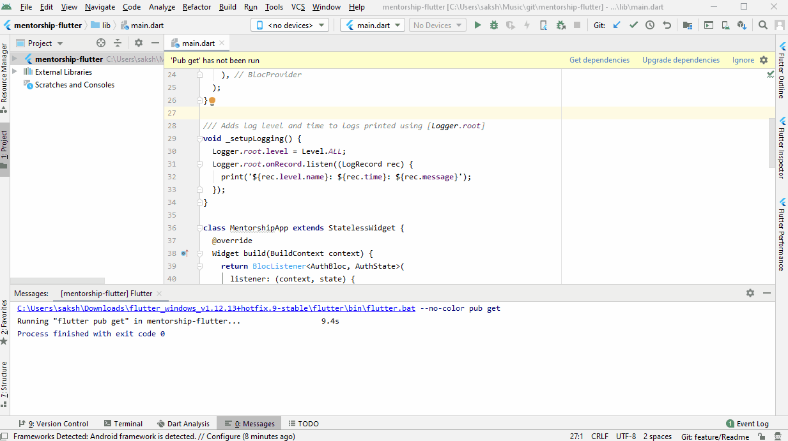
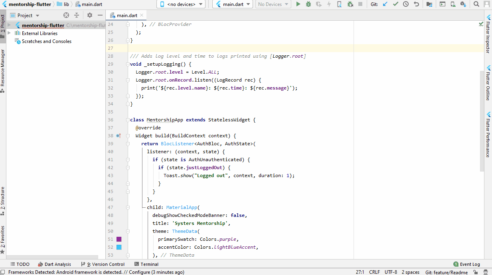
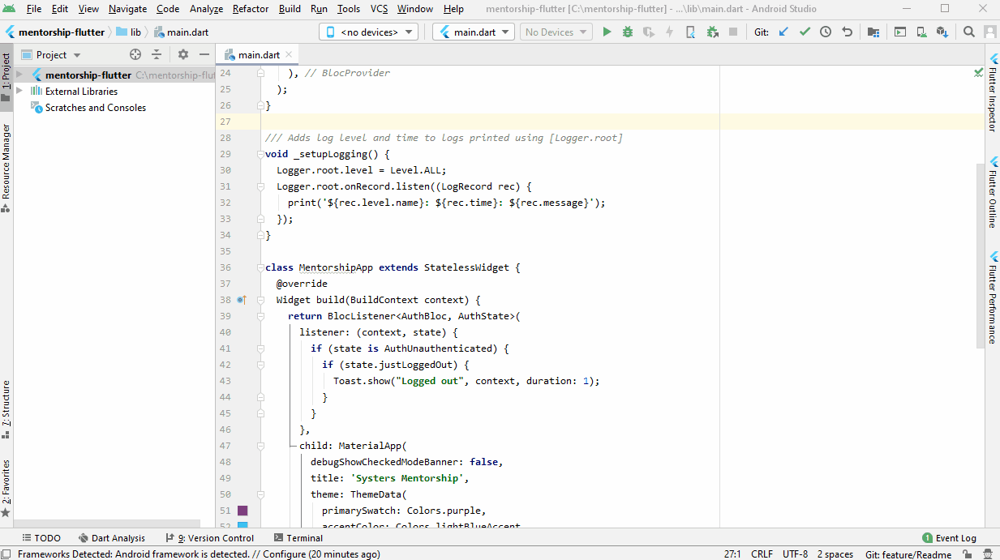
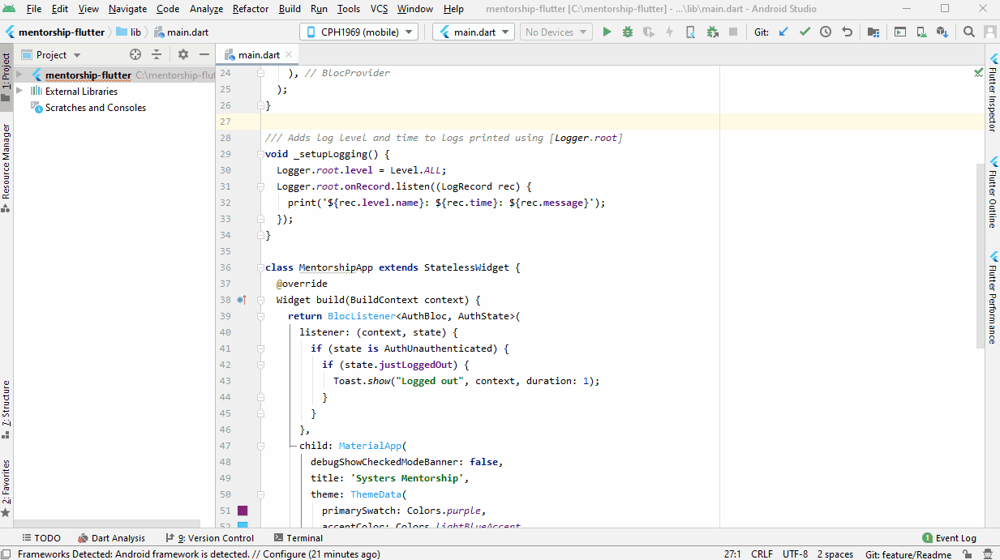

## Setup instructions

#### Prerequisites
 - Android Studio or any IDE to open Flutter project
 - JDK

#### Installations
1. Install Flutter by following instructions from [flutter.dev](https://flutter.dev). To summarise:
  - Select the appropriate operating system
  - Download the flutter sdk to a preferred location on your local system.
2. Fork and clone the [mentorship-flutter](https://github.com/anitab-org/mentorship-flutter) repository to your local machine.
3. Make sure to install the **Flutter** and **Dart** plugins.
  - If mentorship Flutter is the first project that you will be viewing in Android Studio then:
      - Start Android Studio
      - Open Plugin Preferences
      - Browse repositories and search for flutter
      - Install and click yes to install Dart as well if prompted.
  - Flutter and dart can also be installed after opening a project.
      - Go to File menu -> Settings -> plugins
      - Search for the plugin. In this case it would be Flutter and Dart. Install them if not done yet and click Apply.

      

## Local Development Setup
 This section will help you set up the project locally on your system.
 1. Open the project on your IDE. Initially, there would be alot of errors.
 2. Open the terminal and run `flutter channel beta` to switch from stable channel to beta channel of flutter. The beta channel is the one used for the project.

 

 3. Ensure that the Flutter SDK is provided the correct path. Open File menu -> Settings -> Languages & Frameworks -> Flutter

 

 4. In order to run A flutter project either a virtual device needs to be setup or manual device can be used. Remember to `enable Debugging` in **Developer Options** in the manual device.
 5. Connect your manual device or setup the virtual device before you run the application. Ensure that the device is visible on top menu.

     
 6. Once done, run the project by running `flutter run` in the terminal to run the app in debug mode. To build a release build you can do the following:

  *for Android app*

  In the terminal, run the `flutter build apk` command. To build the apk specific to your device arch you can run `flutter build apk --split-per-abi` or `flutter build appbundle --target-platform android-arm,android-arm64,android-x64` (remove arguments which are not required) to get only your arch build. You can read more about this [here](https://flutter.dev/docs/deployment/android)

  *for IOS app*

  To build a release for IOS app, run `flutter build ios` from the terminal. To learn more on creating build archive, release app on TestFlight or to App Store, click [here](https://flutter.dev/docs/deployment/ios).

By default the backend of this project is set to the mentorship-backend dev server. You are now set to go.
